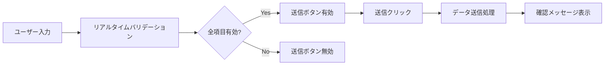

# Sansan Reserve - 機能仕様書

## 概要

写真スタジオの予約システムです。エンドユーザーが基本情報を入力して撮影予約を申し込むことができます。

## 提供機能

### 1. 予約フォーム機能

エンドユーザー向けの予約申し込みフォームを提供します。

#### 入力項目

| 項目名 | 項目ID | 入力形式 | 必須 | バリデーション |
|--------|--------|----------|------|----------------|
| お名前（姓） | lastName | テキスト | ○ | 入力必須 |
| お名前（名） | firstName | テキスト | ○ | 入力必須 |
| メールアドレス | email | メール | ○ | 入力必須、メール形式チェック |
| 撮影希望日時 | preferredDateTime | 日時 | ○ | 入力必須 |
| 撮影メニュー | menu | 選択 | ○ | 入力必須、4種類から選択 |

#### 撮影メニュー

| メニュー名 | 値 | 撮影時間 |
|-----------|-----|----------|
| スタンダードプラン | standard | 30分 |
| プレミアムプラン | premium | 60分 |
| ファミリープラン | family | 90分 |
| ウェディングプラン | wedding | 120分 |

### 2. フォーム操作機能

#### 2.1 リアルタイムバリデーション

- 各入力項目に対してリアルタイムでバリデーションを実行
- エラーがある場合は入力欄の下にエラーメッセージを表示
- 全項目が有効な場合のみ送信ボタンが有効化

#### 2.2 送信機能

- 全項目が有効な場合に送信ボタンをクリック可能
- 送信時に入力内容をコンソールに出力
- 送信完了後、確認メッセージをアラート表示
- ※現在はAPI連携なし（今後実装予定）

#### 2.3 クリア機能

- 「クリア」ボタンで全入力内容をリセット
- フォームのバリデーション状態もリセット

### 3. UI/UXの特徴

#### レスポンシブデザイン

- モバイル、タブレット、デスクトップに対応
- 画面サイズに応じてレイアウトを最適化
- 姓名の入力欄は中画面以上で横並び表示

#### Material Design

- Vuetify 3を使用したMaterial Designベースのデザイン
- 統一感のあるUIコンポーネント
- アクセシビリティに配慮した実装

#### カラースキーム

- プライマリーカラー: Vuetifyのデフォルトプライマリー色
- カードヘッダー: プライマリーカラー背景、白文字
- ボタン: プライマリー（送信）、グレー（クリア）

## 技術構成

### フロントエンド

- **Vue 3** (Composition API / script setup)
- **TypeScript** (型安全な開発)
- **Vuetify 3** (UIコンポーネントライブラリ)
- **Tailwind CSS v4** (ユーティリティCSS)
- **Vue Router** (ルーティング)

### ビルドツール

- **Vite** (高速開発サーバー、最適化されたビルド)

### デプロイ

- **GitHub Pages** (静的サイトホスティング)
- **GitHub Actions** (自動デプロイ)

## ファイル構成

```
src/
├── components/
│   └── BasicInfoForm.vue      # 予約フォームコンポーネント
├── views/
│   └── Home.vue               # ホームページ（フォーム表示）
├── plugins/
│   ├── router.ts              # Vue Router設定
│   ├── vuetify.ts             # Vuetify設定
│   └── tailwind.css           # Tailwind CSS設定
├── App.vue                     # ルートコンポーネント
└── main.ts                     # エントリーポイント
```

## データフロー



## 今後の拡張予定

### Phase 2: バックエンド連携

- [ ] APIサーバーとの連携
- [ ] 予約データの永続化
- [ ] メール送信機能

### Phase 3: 予約管理機能

- [ ] 予約一覧表示
- [ ] 予約状況カレンダー
- [ ] 予約の変更・キャンセル

### Phase 4: 管理者機能

- [ ] 管理者ログイン
- [ ] 予約管理画面
- [ ] スケジュール管理
- [ ] 顧客管理

## セキュリティ

### 現在の対策

- クライアントサイドバリデーション実装
- XSS対策（Vueの自動エスケープ）
- TypeScriptによる型安全性

### 今後実装予定

- [ ] サーバーサイドバリデーション
- [ ] CSRF対策
- [ ] 認証・認可機能
- [ ] SSL/TLS通信

## ブラウザ対応

- Chrome (最新版)
- Firefox (最新版)
- Safari (最新版)
- Edge (最新版)

※ IE11は非対応

## ライセンス

プライベートプロジェクト

## 更新履歴

### v0.1.0 (2025-01-12)

- 初期リリース
- 基本的な予約フォーム機能を実装
- GitHub Pagesデプロイ設定
